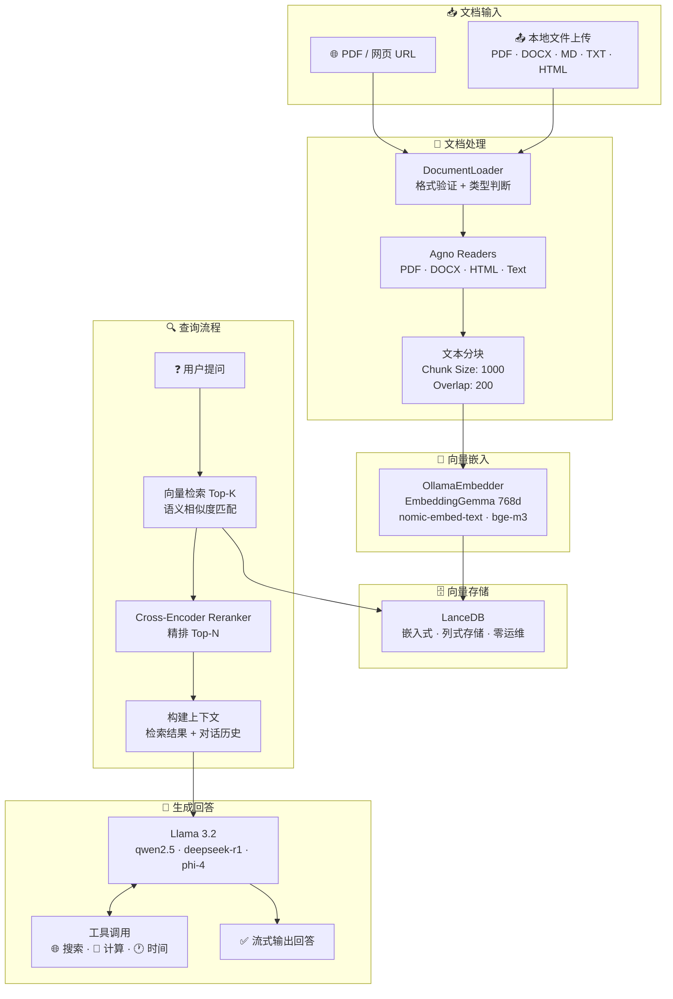
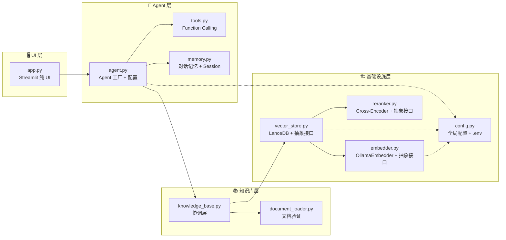

# 🔮 DeepQuery — 100% 本地 Agentic RAG 知识库问答系统

<div align="center">

**100% Local · Privacy-First · Agent-Powered**

[](https://www.python.org/)
[](https://streamlit.io/)
[](https://ollama.com/)
[](https://lancedb.github.io/lancedb/)
[](./.github/workflows/ci.yml)
[](LICENSE)

[English](#-what-is-deepquery) · [快速开始](#-快速开始) · [架构设计](#-architecture) · [开发指南](#-开发指南)

</div>

---

## 🎯 What is DeepQuery?

**DeepQuery** is a 100% locally-running Agentic RAG (Retrieval-Augmented Generation) knowledge-base Q&A system. Upload your documents — PDFs, Word files, Markdown, web pages — and ask questions in natural language. The system retrieves the most relevant passages, re-ranks them for precision, and generates cited answers — all powered by local LLMs through Ollama. **No cloud API calls. No data leaves your machine.**

> **一句话概括**：DeepQuery 是一个 100% 本地运行的智能知识库问答系统。上传文档 → 自动解析 → 向量检索 → AI 生成回答，全程本地运行，数据不出你的电脑。

---

## ✨ 核心特性 | Core Features

### 📄 多格式文档支持 | Multi-format Documents
- 🔗 **URL 加载** — 输入 PDF / 网页 URL，自动下载并解析
- 📤 **本地上传** — 支持 PDF、Word (.docx)、Markdown、TXT、HTML
- 🔄 **拖拽上传** — Streamlit 原生文件上传组件，体验流畅
- 💾 **来源持久化** — 重启应用后自动恢复已加载的文档列表

### 🧠 智能检索增强 | Intelligent Retrieval
- 🔍 **向量语义检索** — Google EmbeddingGemma (768维) 嵌入，LanceDB 列式存储
- 🎯 **Cross-Encoder 重排序** — 粗排 Top-20 → 精排 Top-5，显著提升答案准确性
- 🔧 **可替换嵌入模型** — 一行配置切换 `embeddinggemma` / `nomic-embed-text` / `bge-m3`
- 📊 **可替换向量数据库** — 抽象接口设计，可接入 ChromaDB / FAISS / Qdrant

### 🤖 Agent 智能体能力 | Agentic Capabilities
- 🛠️ **工具调用 (Function Calling)** — 网页搜索 (DuckDuckGo)、数学计算、实时时间查询
- 💭 **ReAct 推理可视化** — 实时展示 Agent 的「思考 → 行动 → 观察 → 回答」全流程
- 💬 **多轮对话记忆** — SQLite 持久化 session + 上下文注入，支持跨对话追问
- 📜 **历史会话管理** — 浏览、切换、重命名、删除历史对话

### 🎨 专业 UI 设计 | Professional UI
- 🖥️ **ChatGPT 风格布局** — 左侧文档管理 + 右侧对话区，直观高效
- 🌈 **品牌化设计系统** — Indigo + Cyan 浅色主题，立体阴影层级
- 📱 **响应式适配** — 移动端 / 平板均有优化体验
- ⚡ **流式输出** — 实时打字机效果，体验丝滑

### 🏗️ 工程化保障 | Engineering Quality
- ✅ **37 个测试** — 单元测试 (17) + 集成测试 (20)，覆盖核心模块
- 🔍 **CI/CD** — GitHub Actions 自动运行 lint + type check + test
- 📝 **完整类型注解** — 所有函数参数和返回值标注类型
- 📋 **Pre-commit Hooks** — Black 格式化 + Ruff 检查 + Mypy 类型检查
- 🗂️ **模块化架构** — 每层职责单一、可替换、可测试

---

## 🏗️ Architecture | 架构设计

### 系统数据流 | Data Flow



### 代码分层架构 | Layered Architecture



> **设计原则**：每一层都定义了抽象接口 (`BaseVectorStore`, `BaseEmbedder`, `BaseReranker`)，具体实现可插拔替换。上层模块依赖抽象而非具体实现，遵循依赖倒置原则 (DIP)。

---

## 🚀 快速开始 | Quick Start

### 前置条件 | Prerequisites

- **Python 3.11+**
- **Ollama** 已安装并运行 → [下载 Ollama](https://ollama.com/download)

### Step 1: 克隆项目 + 安装依赖

```bash
# 克隆仓库
git clone https://github.com/your-username/deepquery.git
cd deepquery

# 创建虚拟环境（推荐）
python -m venv .venv
source .venv/bin/activate  # Windows: .venv\Scripts\activate

# 安装依赖
pip install -r requirements.txt

# 复制环境变量配置
cp .env.example .env
```

### Step 2: 下载模型

```bash
# 启动 Ollama 服务（如果尚未运行）
ollama serve

# 下载嵌入模型（将文档转为向量）
ollama pull embeddinggemma:latest   # 768维，Google 出品

# 下载生成模型（回答问题）
ollama pull llama3.2:latest         # 轻量高效

# 可选：其他模型
ollama pull qwen2.5:latest          # 中英文均衡
ollama pull deepseek-r1:latest      # 推理能力强
```

### Step 3: 启动应用

```bash
streamlit run app.py
```

浏览器访问 `http://localhost:8501`，开始使用！🎉

### ⚡ 3 步体验完整流程

1. **加载文档** → 侧边栏输入 PDF URL，或上传本地文件
2. **等待索引** → 系统自动解析、分块、嵌入、存储（进度条提示）
3. **开始提问** → 在聊天框输入问题，Agent 自动检索知识库并生成回答

---

## 📖 使用指南 | User Guide

### 知识库管理 | Knowledge Base

#### 添加文档来源

| 方式 | 操作 | 支持格式 |
|------|------|----------|
| **URL** | 侧边栏输入框填写 URL | PDF、网页 (HTML) |
| **本地上传** | 点击 "选择文件" 按钮 | PDF、DOCX、MD、TXT、HTML |
| **拖拽上传** | 拖拽文件到上传区域 | 同上 |

#### 管理已加载文档

- 📋 侧边栏实时展示所有已加载的文档列表
- 👁️ 每个文档显示名称、类型图标、加载时间
- 🗑️ 一键清空整个知识库并重建

### Agent 功能使用 | Agent Features

#### 工具调用 (Function Calling)

Agent 会自动判断何时需要使用工具，无需手动干预：

| 工具 | 触发条件示例 | 说明 |
|------|-------------|------|
| 🌐 **网页搜索** | "最近 AI 领域有什么新闻？" | DuckDuckGo 免费搜索 |
| 🔢 **数学计算** | "计算 2^10 + sqrt(1024)" | 安全沙箱 eval |
| 🕐 **时间查询** | "今天是星期几？" | 系统实时时间 |

> 可在 `.env` 中设置 `ENABLE_TOOLS=false` 关闭工具调用，或通过 `TOOLS_EXCLUDE=search_web` 禁用特定工具。

#### ReAct 推理可视化

开启 `SHOW_REACT_PROCESS=true`（默认）后，每次问答都会展示 Agent 的推理过程：

- 🟣 **思考 (Reasoning)** — Agent 内部推理
- 🔵 **行动 (Action)** — 调用了哪个工具、传了什么参数
- 🟢 **观察 (Observation)** — 工具返回了什么结果
- 🟠 **回答 (Answer)** — 基于检索和工具结果的最终回答

#### 对话记忆

- 默认开启多轮对话记忆（`ENABLE_CONVERSATION_MEMORY=true`）
- Session 自动持久化到 SQLite (`data/sessions.db`)
- 侧边栏可浏览、切换、删除历史对话
- 点击 "新对话" 开始全新会话

### 配置调优 | Configuration

编辑 `.env` 文件调整系统参数：

```bash
# 切换嵌入模型（修改后需清空知识库重新加载文档）
EMBEDDING_MODEL=nomic-embed-text:latest  # 或 bge-m3:latest
EMBEDDING_DIMENSIONS=768

# 切换 LLM 模型（无需清空知识库）
LLM_MODEL=qwen2.5:latest  # 或 deepseek-r1:latest

# Reranker 调优
RERANKER_ENABLED=true           # 启用/禁用重排序
RERANKER_MODEL=cross-encoder/ms-marco-MiniLM-L-6-v2  # 英文轻量
# RERANKER_MODEL=BAAI/bge-reranker-v2-m3             # 多语言强大
RETRIEVAL_TOP_K=20              # 粗排召回数量
RERANKER_TOP_N=5                # 精排保留数量

# 文档分块
CHUNK_SIZE=1000                 # 文本块大小（字符数）
CHUNK_OVERLAP=200               # 块间重叠（避免截断语义）

# 对话记忆
NUM_HISTORY_RUNS=10             # 携带的历史轮次数
```

---

## 🧠 技术选型说明 | Technical Decisions

### 为什么选 Ollama？（而非 OpenAI API）

| 维度 | Ollama | OpenAI API |
|------|--------|------------|
| **数据隐私** | ✅ 100% 本地，数据不出机器 | ❌ 数据上传到云端 |
| **运行成本** | ✅ 完全免费 | ❌ 按 token 计费 |
| **离线可用** | ✅ 无需网络 | ❌ 必须联网 |
| **模型选择** | ✅ 开源模型任意切换 | ❌ 仅限 OpenAI 模型 |
| **延迟** | 取决于本地硬件 | 取决于网络 + API 负载 |
| **适用场景** | 企业内网、涉密数据、个人研究 | 通用场景、快速原型 |

> **面试话术**："我选择 Ollama 是因为它解决了企业级 RAG 最核心的痛点之一——数据隐私。很多企业有严格的合规要求，数据不能离开内网。Ollama + 开源模型实现了完全本地化部署，同时保持了 API 风格的调用接口，兼顾了开发效率和安全性。"

### 为什么选 LanceDB？（而非 ChromaDB / FAISS / Qdrant）

| 维度 | LanceDB | ChromaDB | FAISS | Qdrant |
|------|---------|----------|-------|--------|
| **部署方式** | ✅ 嵌入式（进程内） | ✅ 嵌入式 | ✅ 库 | ❌ 需独立服务 |
| **存储格式** | Lance（列式） | SQLite | 内存/磁盘 | 自定义 |
| **混合检索** | ✅ 向量 + 全文 | ⚠️ 有限 | ❌ 仅向量 | ✅ 完整 |
| **大规模性能** | ✅ 列式扫描快 | ⚠️ 中等 | ✅ 顶尖 | ✅ 优秀 |
| **运维成本** | ✅ 零（纯文件） | ✅ 零 | ✅ 零 | ❌ 需维护服务 |
| **生态集成** | Agno 原生支持 | LangChain 友好 | Meta 出品 | Rust 高性能 |

> **面试话术**："LanceDB 的最大优势是嵌入式 + 列式存储。对于个人项目和小团队部署，不需要额外维护一个向量数据库服务——数据直接存在本地文件里，备份和迁移就是复制文件夹。底层基于 Lance 列式格式，扫描性能远超基于行的存储。而且它原生支持向量检索 + 全文检索的混合搜索，这是 ChromaDB 目前比较欠缺的。"

### 为什么选 Agno？（而非 LangChain / LlamaIndex）

| 维度 | Agno | LangChain | LlamaIndex |
|------|------|-----------|------------|
| **学习曲线** | ✅ 低（声明式 API） | ❌ 陡峭（链式抽象多） | ⚠️ 中等 |
| **Agent 支持** | ✅ 核心能力 | ⚠️ 复杂 | ⚠️ 有限 |
| **Ollama 集成** | ✅ 原生支持 | ⚠️ 需社区适配器 | ⚠️ 需社区适配器 |
| **工具调用** | ✅ 自动 JSON Schema | ⚠️ 需手动定义 | ⚠️ 有限 |
| **代码量** | ✅ 简洁（10行创建Agent） | ❌ 样板代码多 | ⚠️ 中等 |
| **生产就绪** | ✅ Service + API | ✅ 成熟生态 | ✅ 检索专注 |

> **面试话术**："选择 Agno 的核心原因是它的 Agent 一等公民设计。在 LangChain 里，Agent 是链条中的一个节点；在 Agno 里，Agent 是核心抽象，知识库、工具、记忆都是 Agent 的附属能力。这使得代码组织更自然——`Agent.knowledge` 而非 `chain.add_retriever()`。另外 Agno 对 Ollama 的原生支持让本地部署零摩擦，不需要额外适配。"

### 为什么需要 Reranker？

```
Without Reranker:
  用户查询 → 向量检索 Top-5 → 直接送入 LLM
  问题: 向量相似度 ≠ 语义相关性，Top-5 中可能混入无关内容

With Reranker:
  用户查询 → 向量检索 Top-20 (粗排) → Cross-Encoder 精排 → Top-5 → LLM
  优势: Cross-Encoder 同时看 query 和 document 全文，
       理解句间关系，精准度远超双塔模型
```

> **面试话术**："Reranker 是 RAG 系统的关键优化点。向量检索使用的是双塔模型——query 和 document 分别编码后算余弦相似度，两者在编码时互不可见。Cross-Encoder Reranker 将 query 和 document 拼接后一起编码，能捕捉到词级交互和句间关系，相关性判断准确得多。代价是计算量更大，所以不能对全库做，只对粗排的 Top-K 候选做精排。"

---

## 📁 项目结构 | Project Structure

```
agentic_rag/
├── app.py                         # 🖥️  Streamlit UI 入口（纯界面层）
├── src/                           # 📦 核心源码
│   ├── __init__.py
│   ├── config.py                  # ⚙️  全局配置（所有可调参数集中管理）
│   ├── agent.py                   # 🤖  Agent 工厂（创建 + 配置 Agno Agent）
│   ├── knowledge_base.py          # 📚  知识库管理器（文档→嵌入→存储的协调层）
│   ├── document_loader.py         # 📄  文档加载器（格式验证 + 类型判断）
│   ├── vector_store.py            # 🗄️  向量数据库抽象层（LanceDB 实现）
│   ├── embedder.py                # 🧠  嵌入模型抽象层（OllamaEmbedder 实现）
│   ├── reranker.py                # 🎯  Cross-Encoder 重排序模块
│   ├── memory.py                  # 💬  多轮对话记忆 + Session 管理
│   └── tools.py                   # 🛠️  Agent 工具（搜索、计算、时间）
├── tests/                         # 🧪 测试
│   ├── __init__.py
│   ├── conftest.py                # Pytest fixtures
│   ├── test_document_loader.py    # 6 个单元测试
│   ├── test_embedder.py           # 10 个单元测试
│   ├── test_knowledge_base.py     # 3 个单元测试
│   └── test_integration.py        # 18 个集成测试（需要 Ollama）
├── data/                          # 📊 数据目录
│   ├── lancedb/                   # LanceDB 向量数据库文件
│   ├── uploads/                   # 用户上传的文档
│   ├── sessions.db                # SQLite 对话历史
│   └── loaded_sources.json        # 已加载来源持久化
├── .streamlit/
│   └── config.toml                # 🎨 Streamlit 主题配置
├── .github/workflows/
│   └── ci.yml                     # 🔄 GitHub Actions CI 流水线
├── .env.example                   # 📝 环境变量模板
├── .pre-commit-config.yaml        # ✅ Pre-commit Hooks 配置
├── pyproject.toml                 # 📋 项目元数据 + 工具链配置
├── requirements.txt               # 📦 Python 依赖列表
└── README.md                      # 📖 本文件
```

---

## 🔧 开发指南 | Development Guide

### 运行测试

```bash
# 单元测试（不需要 Ollama，任何时候都能跑）
pytest tests/ -v -m "not integration"

# 单个测试文件
pytest tests/test_document_loader.py -v

# 集成测试（需要 Ollama 运行 + 模型已下载）
pytest tests/ -v -m "integration"

# 全部测试（需要 Ollama）
pytest tests/ -v
```

### 代码质量

```bash
# 安装 pre-commit hooks（首次）
pip install pre-commit
pre-commit install

# 手动运行所有检查
pre-commit run --all-files

# 单独运行各工具
black src/ tests/ app.py          # 格式化
ruff check src/ tests/ app.py     # 代码检查
mypy src/ --ignore-missing-imports # 类型检查
```

### 添加新功能

项目采用**抽象接口 + 具体实现**的架构模式，添加新能力非常直观：

**1. 添加新的嵌入模型**

```python
# 只需修改 .env 中的一行配置
EMBEDDING_MODEL=nomic-embed-text:latest
```

**2. 添加新的向量数据库**

```python
# 在 vector_store.py 中实现 BaseVectorStore 接口
class ChromaDBStore(BaseVectorStore):
    def add(self, documents): ...
    def search(self, query_vector, top_k): ...
    def delete(self): ...
    def exists(self): ...

# 然后在 knowledge_base.py 中注入使用
kb = KnowledgeBaseManager(vector_store=ChromaDBStore())
```

**3. 添加新的 Agent 工具**

```python
# 在 tools.py 中添加工具函数
def my_new_tool(param: str) -> str:
    """Tool description (used to generate JSON Schema).

    Args:
        param: Parameter description.

    Returns:
        Tool result.
    """
    # 实现逻辑
    return result

# Agno 自动从 docstring + type hints 生成 JSON Schema
DEFAULT_TOOLS.append(Function.from_callable(my_new_tool))
```

**4. 添加新的文档格式**

```python
# 在 document_loader.py 的 SUPPORTED_SUFFIXES 中添加
SUPPORTED_SUFFIXES = {".pdf", ".txt", ".md", ".docx", ".html", ".epub", ".csv"}
# Agno 已内置了大多数格式的 Reader，无需额外代码
```

### CI/CD 流水线

每次 push 到 `main` 分支或提交 PR 时，GitHub Actions 自动运行：

| Job | 内容 |
|-----|------|
| 🔍 **Lint & Type Check** | Ruff + Black + Mypy |
| 🧪 **Unit Tests** | pytest (Python 3.11 + 3.12) 跳过集成测试 |

---

## 📊 技术栈 | Tech Stack

| 层级 | 技术 | 选型理由 |
|------|------|----------|
| **UI 框架** | Streamlit | 纯 Python，快速构建数据应用 |
| **Agent 框架** | Agno | Agent 一等公民，Ollama 原生支持 |
| **LLM 运行时** | Ollama | 100% 本地，数据隐私，零成本 |
| **嵌入模型** | EmbeddingGemma (768d) | Google 出品，质量可靠 |
| **生成模型** | Llama 3.2 | Meta 开源，轻量高效 |
| **向量数据库** | LanceDB | 嵌入式，列式存储，零运维 |
| **Reranker** | Sentence-Transformers | Cross-Encoder 精排，本地运行 |
| **文档解析** | pypdf / python-docx / BS4 | 多格式覆盖 |
| **搜索工具** | DuckDuckGo (ddgs) | 免费，无需 API Key |
| **测试框架** | pytest | Python 生态标准 |
| **代码质量** | Black + Ruff + Mypy | 格式化 + Lint + 类型检查 |
| **CI/CD** | GitHub Actions | 每次 push 自动检查 |

---

## 🗺️ 路线图 | Roadmap

参见项目 [TODO.md](./note/TODO.md) 的完整规划，以下是重点方向：

- [ ] **混合检索 (Hybrid Search)** — 向量检索 + 关键词匹配 (BM25)，提升召回率
- [ ] **引用溯源** — 回答中标注信息来源（哪个文档、哪一页）
- [ ] **多知识库管理** — 创建/切换不同的知识库（论文库、技术文档库等）
- [ ] **GraphRAG** — 知识图谱增强检索，抽取实体和关系
- [ ] **Docker 化** — 一键部署 `docker-compose up`
- [ ] **API 模式** — FastAPI 接口，供其他应用调用
- [ ] **量化支持** — llama.cpp GGUF 量化模型，降低显存占用
- [ ] **多 Agent 协作** — 检索 Agent + 回答 Agent + 验证 Agent

---

## 🙋 FAQ

<details>
<summary><b>Q: RAG 的 Chunk Size 怎么选的？</b></summary>

默认 `CHUNK_SIZE=1000` 字符、`CHUNK_OVERLAP=200` 字符。1000 字符大约是 250-300 个英文单词或 500-600 个中文字，这个粒度在语义完整性和检索精度之间取得了平衡。Overlap 设为 20% 避免关键信息刚好落在两个 chunk 的边界被截断。

可以根据文档类型调整：代码文档可以用更小的 chunk（500），论文/书籍可以用更大的（1500-2000）。
</details>

<details>
<summary><b>Q: 怎么评估检索效果？</b></summary>

当前项目通过集成测试（`test_integration.py`）验证端到端流程正确性。生产级评估需要：

1. **离线评估** — 准备标注数据集（问题 + 正确答案），计算 Recall@K、MRR、NDCG
2. **在线评估** — 用户反馈（点赞/点踩）、人工抽检
3. **RAGAS 框架** — 自动化评估 Faithfulness（忠实度）、Answer Relevance（答案相关性）、Context Relevance（上下文相关性）

Reranker 是提升检索质量最直接的优化手段——本项目已实现。
</details>

<details>
<summary><b>Q: 如果文档很大（几百页），怎么优化检索速度？</b></summary>

1. **分层检索** — 先检索章节/段落，再检索具体内容块
2. **摘要索引** — 为每个文档预生成摘要，检索时先匹配摘要
3. **增加粗排召回量 + Reranker 精排** — 本项目已采用此方案（Top-20 → Top-5）
4. **切换更快的嵌入模型** — `nomic-embed-text` 比 `embeddinggemma` 更快
5. **GPU 加速** — Ollama 自动利用 GPU，模型加载到显存后推理速度提升数倍
</details>

<details>
<summary><b>Q: 怎么处理检索不到相关内容的情况（防幻觉）？</b></summary>

Agent 的系统指令中明确要求：

> "If the answer is not found in the knowledge base, say so honestly."

同时通过 Reranker 提升检索精度（减少无关内容混入），以及工具调用能力让 Agent 在知识库无结果时可以搜索网页补充信息。未来计划加入**引用溯源**，强制每个断言都有来源支撑。
</details>

<details>
<summary><b>Q: 和直接用 ChatGPT 传文件有什么区别？</b></summary>

| 维度 | DeepQuery | ChatGPT 传文件 |
|------|-----------|---------------|
| **数据隐私** | ✅ 数据不上传 | ❌ 上传到 OpenAI 服务器 |
| **运行成本** | ✅ 免费（本地算力） | ❌ 需 Plus 订阅 |
| **离线可用** | ✅ 完全离线 | ❌ 必须联网 |
| **模型选择** | ✅ 任意开源模型 | ❌ 只能用 OpenAI 模型 |
| **知识库规模** | ✅ 无上限（本地磁盘） | ⚠️ 单次上传有文件大小限制 |
| **持久化** | ✅ 知识库持久化，重启保留 | ❌ 每次对话重新上传 |
</details>

---

## 📄 License | 许可证

MIT License — 自由使用、修改、分发。

---

<div align="center">

**🔮 DeepQuery — 让知识检索更智能，让数据隐私更安全**

Built with ❤️ using [Agno](https://github.com/agno-agi/agno) · [Ollama](https://ollama.com) · [LanceDB](https://lancedb.github.io/lancedb) · [Streamlit](https://streamlit.io)

</div>
